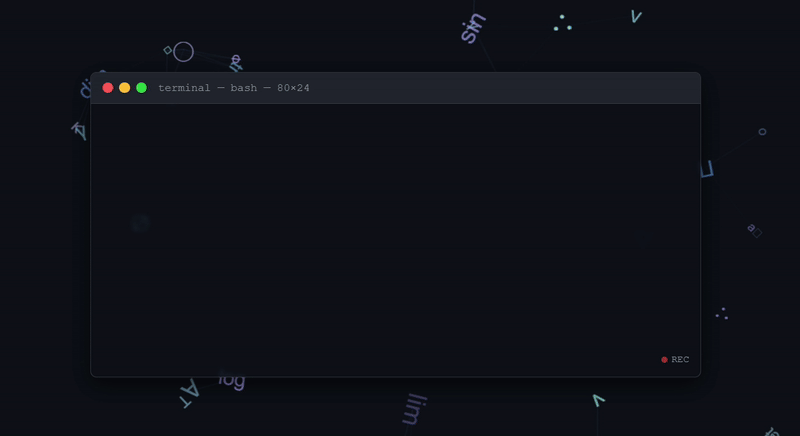

<!-- 主GIF -->

<!-- 社交链接 -->

  
  

<h1 align="center">Hey there 👋 I'm JNU-XIA-IOCoding</h1>

###

  

<h1 align="center">🛠 Language and Tools</h1>

  
  
  
  
  
  
  
  
  
  
  
  
  
  
  

 

  
  
  
  
  
  
  
  
  

###

<h1 align="center">👩‍💻 About Me</h1>

  

    - 🏫 Computer Science student at Jinan University 
    - 💻 Passionate about software development and open source 
    - 🚀 Focused on full-stack development and system design 
    - 🌱 Currently exploring distributed systems and cloud computing 
    - ✨ Believer in technology for positive change
  

###

<h1 align="center">💖 My Inspiration</h1>

  
   
  <h3>Estelle~涵 💫</h3>
  
A constant source of motivation and inspiration in my life and coding journey

###

  

###

<h1 align="center">📊 GitHub Stats</h1>

  
  

###

  
⭐ <em>Keep coding, keep exploring!</em> ⭐

